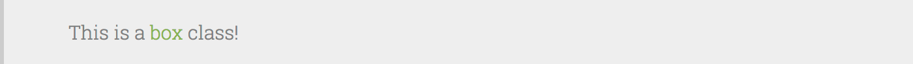
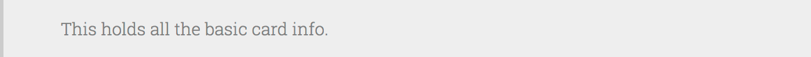
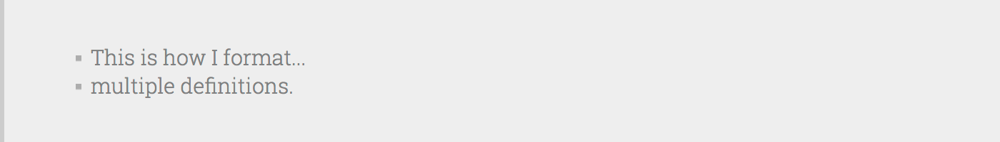
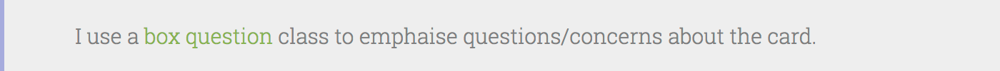
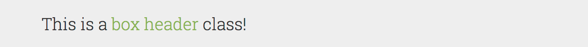
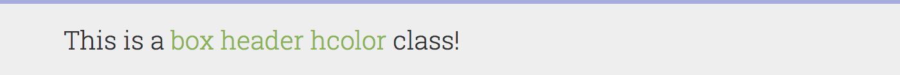
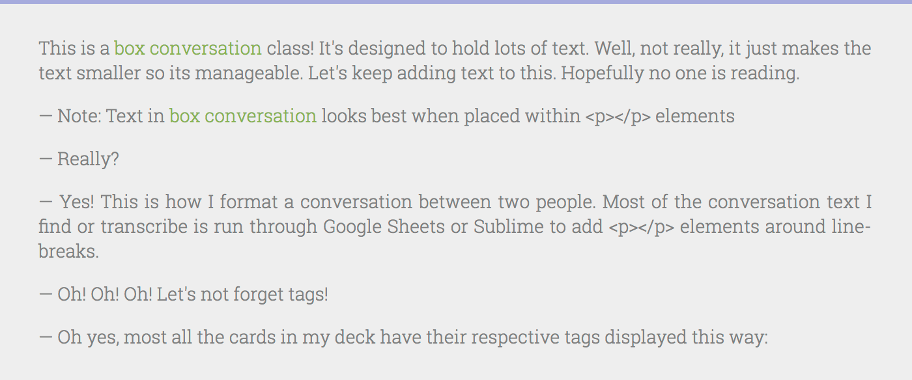
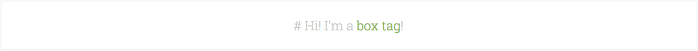

# anki_style

A live version of anki_style can be seen here: https://se110785.github.io/anki_style/

Each of these boxes you see here are part of a standardized style sheet I've developed over the past year or so while using Anki. It by no means is an exhaustive set of classes for all situations but it covers the more basic things when learning a language. Namely reviewing: vocabulary, sentences, and conversations. Most of these classes, if not all, can also be used with any type of card, it's really not limited to languages or any topic.

The motivation behind this was that I was looking for a way to flexibly format and re-format my cards. Removing almost all HTML and CSS from Anki ensures that I can change/edit/tweak the color palette or overall theme without having to sift through thousands of cards.

`box`:
```html
<div class="box">{{field}}</div>
```




<br>


`question` box:
``` html
<div class="box question">{{field}}</div>
```


<br>


`peek` box:

```html
<div class="box peek">{{field}}</div>
```
This takes any `box` class and makes the inner text invisible until a hover. It makes cards "three-sided." A sentence translation can be revealed on the back template only after someone has hovered over the box. For example, with a listening card, the back of a card can be revealed to confirm what was heard in the target language without revealing the translation.


<br>


`header` box:
``` html
<div class="box header">{{field}}</div>
```


<br>


`header` box colored:
``` html
<div class="box header hcolor">{{field}}</div>
<div class="box header hgray">{{field}}</div>
```
This is a purely aesthetic adjustment to the top border color of the `header` class.




<br>


`conversation` box:
``` html
<div class="box conversation">{{field}}</div>
```
This is used for conversation cards. Fonts are styled smaller and some minor aesthetic adjustments.



<br>


`tag` box:
```html
<div class="box tags"># {{field}}</div>
```
Faintly displays the current tags. Note: Actual style does not have outline.



<br>


`pic` box:
```html
<div class="box pic">{{field}}</div>
```
<br>


`hidden`:
Field contents are not rendered on card. Primarily used in two cases. Hide text that's being fed to AwesomeTTS and hide text being fed to a javascript function.
```html
<div class="hidden">{{field}}</div>
```
<br>


## Example:
`Note:` Sentence `Card:` Listen

```html
<!-- Front Template -->
<div class="box header hcolor">Écoute:</div>
{{^Audio}}<tts class="hidden" group="FrenchVoices">{{Phrase}}</tts>{{/Audio}}
{{#Audio}}{{Audio}}{{/Audio}}

<!-- Style -->
@import '_anki_style.css';

<!-- Back Template -->
<div class="box header hcolor">{{Phrase}}</div>
{{#Anglais}}<div class="box peek">{{Anglais}}</div>{{/Anglais}}
{{#Notes}}<div class="box">{{Notes}}</div>{{/Notes}}
{{#Question!}}<div class="box question">{{Question!}}</div>{{/Question!}}
{{#Tags}}<div class="box tags"># {{Tags}}</div>{{/Tags}}
```

[Google Fonts : Roboto Slab](https://fonts.google.com/specimen/Roboto+Slab)

---

## Installation